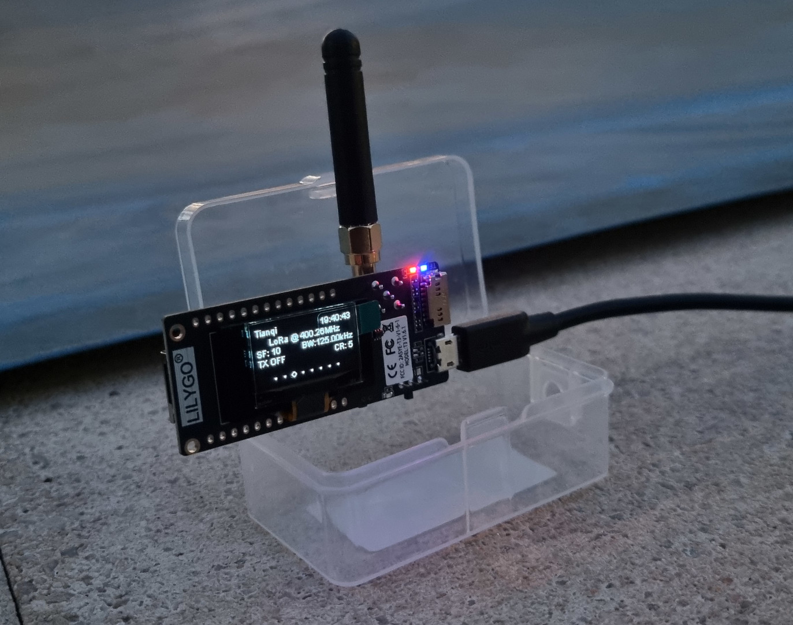

# Proyecto BLE Bonding con ESP32-S3

Documentación del proyecto: objetivo, arquitectura, instrucciones de compilación y uso.

Anem a implementar un Beacon que se guarda el IRK pa aixina mantindre la conexio amb un dispositiu encara que cambie la seua direcció MAC.

